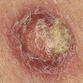

# MELANOMA-DETECTION  
###### What is Melanoma?  
**_'Melanoma'_**, also known as **_'Malignant_Melanoma'_**, is a type
of cancer that develops from the pigment-containing cells known
as _melanocytes_. Melanomas typically occur on the skin, but may rarely
occur in the mouth, intestines, or eye. The primary cause of
melanoma is ultraviolet light (UV) exposure in those with low levels of
skin pigment. The UV light may be from either the sun or from other
sources, such as tanning devices. About 25% develop from moles.  
**Read more at :-> [wikipedia.org/melanoma](https://en.wikipedia.org/wiki/Melanoma)**.  


## About the repository -  
This repo holds the source code for the Melanoma-Detection Application.
Given below is the _'Project Structure'_ :  
  
    .
    |   Main.py
    |   dataset.npz
    |   testcase.npz
    |   README.md
    |---featext
    |     |---physical
    |     |     |   __init__.py
    |     |     |   Gabor.py
    |     |---texture
    |     |     |   __init__.py
    |     |     |   Haralick.py
    |     |     |   King.py
    |     |     |   Tamura.py
    |     |   __init__.py
    |---images
    |     |---benign
    |     |     |   'img_number'.jpg
    |     |---malignant
    |     |     |   'img_number'.jpg
    |     |---negative
    |     |     |   'img_number'.jpg
    |---mlmodels
    |     |   Classifiers.py
    |     |   DecisionSurfacePlotter.py
    |     |   Mel_DTC.pkl
    |     |   Mel_DTR.pkl
    |     |   Mel_LinSVM.pkl
    |     |   Mel_LinSVR.pkl
    |     |   Mel_MLPC.pkl
    |     |   Mel_MLPR.pkl
    |     |   Mel_NuSVM.pkl
    |     |   Mel_NuSVR.pkl
    |     |   Mel_RFC.pkl
    |     |   Mel_RFR.pkl
    |     |   Mel_SVM.pkl
    |     |   Mel_SVR.pkl
    |     |   __init__.py
    |---preprocessing
    |     |   Prep.py
    |     |   __init__.py
    |---results
    |     |---dataset
    |     |     |---benign
    |     |     |     |---'numbers'
    |     |     |     |     |   'images'.jpg
    |     |     |---malignant
    |     |     |     |---'numbers'
    |     |     |     |     |    'images'.jpg
    |     |     |---negative
    |     |     |     |---'numbers'
    |     |     |     |     |    'images'.jpg
    |     |---testset
    |     |     |---benign
    |     |     |     |---'numbers'
    |     |     |     |     |   'images'.jpg
    |     |     |---malignant
    |     |     |     |---'numbers'
    |     |     |     |     |    'images'.jpg
    |     |     |---negative
    |     |     |     |---'numbers'
    |     |     |     |     |    'images'.jpg
    |---temp
    |     |   'img_number'.jpg
    |---test
    |     |   'img_number'.jpg
    |---util
          |   Util.py
          |   __init__.py


## About The Application -  
This application does not contain any fancy _UI_, as it is basically a
modular console program, written in Python3. Anyone, with some basic
programming knowledge will be able to run this app easily.  
Simply, this console app tries to predict the nature of a 'skin-lesion'
image, served as an input.  
To keep things simple, we have trained our machine-learning models, to
classify the input image as one of the three types:  
   + **NEGATIVE** - Represents a skin-lesion that is not melanoma._(-1)_  
   + **BENIGN** - Represents a skin-lesion that is an early-stage melanoma._(0)_  
   + **MALIGNANT** - Represents a skin-lesion that is highly cancerous._(1)_  
   
The application consists of five core modules, namely:  
   1. _Main.py_  (Driver module for the entire application).  
   2. **featext**  ('quatified-features' extraction module for the input_image).  
      + **physical**  ('physical-features' extraction sub-module for the input_image).  
        - _Gabor.py_  (Extracts "Gabor's" physical-features from the input_image).  
      + **texture**   ('textural-features' extraction module for the input_image).  
        - _Haralick.py_  (Extracts "Haralick's" texture-features from the input_image).  
        - _King.py_  (Extracts "King's" texture-features from the input_image).  
        - _Tamura.py_  (Extracts "Tamura's" texture-features from the input_image).  
   3. **mlmodels**  (input_image classification/regression module).  
      + _Classifiers.py_  (Predicts the class of the input_image).  
      + _DecisionSurfacePlotter.py_  (Plots the decision surfaces of the various classifiers/regressors, based on the selected features).  
      + _Mel_DTC.pkl_  (Persistently stores the trained 'Decision Tree Classifier' object).  
      + _Mel_DTR.pkl_  (Persistently stores the trained 'Decision Tree Regressor' object).  
      + _Mel_LinSVM.pkl_  (Persistently stores the trained 'Linear-Support Vector Machine Classifier' object).  
      + _Mel_LinSVR.pkl_  (Persistently stores the trained 'Linear-Support Vector Machine Regressor' object).  
      + _Mel_MLPC.pkl_  (Persistently stores the trained 'Multi-Layer Perceptron Classifier' object).  
      + _Mel_MLPR.pkl_  (Persistently stores the trained 'Multi-Layer Perceptron Regressor' object).  
      + _Mel_NuSVM.pkl_  (Persistently stores the trained 'Nu-Support Vector Machine Classifier' object).  
      + _Mel_NuSVR.pkl_  (Persistently stores the trained 'Nu-Support Vector Machine Regressor' object).   
      + _Mel_RFC.pkl_  (Persistently stores the trained 'Random Forest Classifier' object).  
      + _Mel_RFR.pkl_  (Persistently stores the trained 'Random Forest Regressor' object).  
      + _Mel_SVM.pkl_  (Persistently stores the trained 'Support Vector Machine Classifier' object).  
      + _Mel_SVR.pkl_  (Persistently stores the trained 'Support Vector Machine Regressor' object).  
   4. **preprocessing**  (input_image preprocessing module).  
      + _Prep.py_  (Performs generic image pre-processing operations).  
   5. **util**  (General library utility module).  
      + _Util.py_  (Performs routine data-structural operations ... insertion, searching, sorting etc).  


## How the application works?  
This application works in the following folds :  
1.  Firstly, a 'training-set' data is generated from a collection of various skin-lesion images placed in their respective  
    class folders i.e., _'images/benign'_, _'images/malignant'_, _'images/negative'_. These images are pre-processed and  
    a set of quantified-features are extracted from them, which comprises the 'training-set' data.  
2.  Next, the above generated training data, is then passed on to the various classifier/regressor objects for training/learning.  
3.  Now, the trained models are persistently saved as python objects or pickle units, in individual '.pkl' files.  
4.  Next, a set of input_images in need of classification are placed in the _'temp'_ folder.  
5.  Next, the program takes each input_image pre-processes it and extracts the necessary features from it.  
6.  The features generated from the pre-processed input_images are then passed on to the various  
    machine-learning models,which in turn predicts the nature of each input_image accordingly.  
7.  Since, the learning process here is supervised, a 'prediction-accuracy' is generated for each model.  
8.  Finally, the results from the model with the highest 'prediction-accuracy' are selected.  


## Usage guide -  
### _Pre-requisites_ :  
1. **Python3** ;  
       []  _About 'Python3'_ :point_right: [wikipedia.org/PythonProgrammingLanguage](https://en.wikipedia.org/wiki/Python_(programming_language)).  
       []  _How to install 'Python3'?_ :point_right: [python.org/BeginnersGuide](https://wiki.python.org/moin/BeginnersGuide/Download).  
       []  _Official 'Python3' documentation_ :point_right: [docs.python.org/Python3](https://docs.python.org/3/).  
       []  _GET 'Python3'_ :point_right: [python.org/downloads](https://www.python.org/downloads/).  

2. **Python Package Manager** (any one of the below applications will suffice) ;  
    + **pip** :point_right: comes along with the executable 'python-installation' package.  
        []  _About 'pip'_ >>> [wikipedia.org/pip_packagemanager](https://en.wikipedia.org/wiki/Pip_(package_manager)).  
        []  _How install packages using 'pip'?_ >>> [docs.python.org/inastallingPythonPackagesUsingPip](https://docs.python.org/3/installing/index.html).  
    + **anaconda** :point_right: [**anaconda.com/downloads**](https://www.anaconda.com/download/).  
        []  _About 'anaconda'_ >>> [wikipedia.org/conda](https://en.wikipedia.org/wiki/Anaconda_(Python_distribution)).  
        []  _How to install 'anaconda'?_ >>> [docs.anaconda.com/installingconda](https://enterprise-docs.anaconda.com/en/latest/install/index.html).  
        []  _How to install 'python-packages' with 'conda'?_ >>> [docs.anaconda.com/packages](https://enterprise-docs.anaconda.com/en/latest/data-science-workflows/packages/index.html)  
        []  _Official 'anaconda' documentation?_ >>> [docs.anaconda.com/official](https://enterprise-docs.anaconda.com/en/latest/).  
        
3. **IDE** (optional) ;  
    + **Pycharm** :point_right: [jetbrains.com/getPycharm](https://www.jetbrains.com/pycharm/).  
        []  _About 'Pycharm'_ >>> [wikipedia.org/Pycharm](https://en.wikipedia.org/wiki/PyCharm).  
        []  _How to use 'Pycharm'?_ >>> [jetbrains.com/PycharmGuide](https://www.jetbrains.com/pycharm/documentation/).  

4. **Python Library Dependencies** ;
    + **'NumPy'**.  
        []  _About 'numpy'_ :point_right: [wikipedia.org/numpy](https://en.wikipedia.org/wiki/NumPy).  
        []  _Official 'numpy' manuals_ :point_right: [docs.scipy.org/numpyManuals](https://docs.scipy.org/doc/numpy/).  
        (**Note.-** For installing _NumPy_ through pip, type `python -m pip --user install numpy`.)  
    + **'MatPlotLib'**.  
        []  _About 'matplotlib'_ :point_right: [wikipedia.org/matplotlib](https://en.wikipedia.org/wiki/Matplotlib).  
        []  _Official 'matplotlib' docs_ :point_right: [matplotlib.org/docs](https://matplotlib.org/contents.html).  
        (**Note.-** For installing _MatPlotLib_ through pip, type `python -m pip --user install matplotlib`.)  
    + **'SciPy'**.  
        []  _About 'scipy'_ :point_right: [wikipedia.org/scipy](https://en.wikipedia.org/wiki/SciPy).  
        []  _Official 'scipy' documentations_ :point_right: [scipy.org/docs](https://www.scipy.org/docs.html).  
        (**Note.-** For installing _SciPy_ through pip, type `python -m pip --user install scipy`.)  
    + **'OpenCV'**.  
        []  _About 'opencv'_ :point_right: [wikipedia.org/opencv](https://en.wikipedia.org/wiki/OpenCV).  
        []  _Official 'opencv-python' online tutorial_ :point_right: [opencv-python.org/tutorials](http://opencv-python-tutroals.readthedocs.io/en/latest/py_tutorials/py_tutorials.html).  
        []  _Official 'opencv-python' documentation_ :point_right: [docs.opencv.org/python](https://docs.opencv.org/3.0-beta/index.html).  
        (**Note.-** For installing _OpenCV_ through pip, type `python -m pip --user install opencv-python`.)  
    + **'Scikit-Learn'**.  
        []  _About 'scikit-learn'_ :point_right: [wikipedia.org/Scikit-Learn](https://en.wikipedia.org/wiki/Scikit-learn).  
        []  _Official 'scikit-learn' documentation_ :point_right: [scikit-learn.org/docs](http://scikit-learn.org/stable/documentation.html).  
        (**Note.-** For installing _Scikit-Learn_ through pip, type `python -m pip --user install sklearn`.)  

### _Running the Application_ :  
* Before you download this application, make sure you have installed 'Python3' along with the dependency modules.  
* If you are using any integrated development environment like 'PyCharm', you can simply clone this repository to your  
  project directory, using the git-commandline tools, just type `git clone https://github.com/Tejas07PSK/Melanoma-Detection.git`.  
* As this a 'console/commandline/terminal' application you can simply download this repository as `Melanoma-Detection.zip`  
  compressed file and then extract it accordingly. Now, navigate to the extracted folder in terminal  
  and then run this program by typing `python Main.py`.  
* As you run this application, you will be greeted with the following text as shown in the screenshot.  
    
* Now, if you select option **_'1'_**, you will go through the following phases as shown in the screenshots.  
    
    
    
    
    
    
    
* Next, if you select option **_'2'_**, you will get the following output as shown in the screenshot.  
    
* Next, if you select option **_'3'_**, the operation phase will be very similar to option **_'1'**, as shown in the following screenshots.  
    
    
    
* Next, if you select option **_'7'_**, the existing ml-models will be iteratively trained with the new test-images  
  placed in the _'/temp'_ folder, look at this screenshot.  
    
* Now, if you select option **_'5'_**, you will get the following output, as shown in the screenshots.  
    
    
* If you select option **_'8'_**, you'll get the following output as shown in the screenshots.  
    
    
    
* Option **_'9'_** is used for getting a list of files present in any valid project directory, look at the screenshot.  
    
* Option **_'6'_** is used for plotting the decision-surfaces of the various classifiers/regressors as shown below in the screeenshots.  
    
    
    
    
    
    
* Option **_'4'_** is used for classifying the types of the input-images. For explanation we have considered the following  
  input images,  
         
       ,  
  now look at the screenshots.  
    
    
* Option **_'10'_** is used for displaying the 'R-G-B' color-plates of a selected color-image, as shown in the screenshots.  
    
    
  
  
## About the core functionalities -  
### Pre-processing :  
During the pre-processing phase, the input-image is first converted to 'gray-scale' and then this gray-image is inverted.
Next an 'automatic-thresholding' operation is performed on the 'inverted-gray-scale-image' using 'Otsu's Method'.
A 'threshold-level' is generated, which is then used to binarize the 'inverted-gray-scale-image',i.e., segmentation of the
input-image occurs. Now, some morphological-operations are performed on the binarized-image, to remove holes and contrast inconsistencies.
Finally, a set variations of the original input-image are produced at the end of this phase.  
For example if we consider the following image as the input  
,  
then the pre-processing phase will produce the following resulting images.  
       
The 'Otsu' threshold-level for the 'input-image' above, is **132**.  
**Read more about _Otsu's Thresholding Method_ here** :point_right: [wikipedia.org/Otsu's_Method](https://en.wikipedia.org/wiki/Otsu%27s_method) **and at** :point_right: [labbookpages.co.uk/OtsuThresholding](http://www.labbookpages.co.uk/software/imgProc/otsuThreshold.html).  
**Read more about _Image Segmentation_ here** :point_right: [wikipedia.org/Image_Segmentation](https://en.wikipedia.org/wiki/Image_segmentation).  
**Read more about _Gray-Scale Images_ here** :point_right: [wikipedia.org/grayscaleimages](https://en.wikipedia.org/wiki/Grayscale).  
**Read more about _RGB Color Images_ here** :point_right: [wikipedia.org/rgb_colorimages](https://en.wikipedia.org/wiki/RGB_color_model).  
**Read more about _Binary Images_ here** :point_right: [wikipedia.org/binaryimages](https://en.wikipedia.org/wiki/Binary_image).  
**Read more about _Morphological Operations_ here** :point_right: [wikipedia.org/morphological_operations](https://en.wikipedia.org/wiki/Mathematical_morphology).  
**Read more about _Image Thresholding_ here** :point_right: [wikipedia.org/image_thresholding](https://en.wikipedia.org/wiki/Thresholding_(image_processing)).  

### Feature extraction :
For prediction purposes, this application extracts a total of 34 quatified features from the input-image,
each having their own computational methods.  
1. **_Haralick's texture features_**;  
   Haralick introduced _Gray Level Co-occurrence Matrix (GLCM)_, using which various statisctical and differential textural-features
   of an image are extracted. These features, are primarily based on the 'thermodynamical' aspects of a textured image.
   _GLCM_ shows how often each gray level occurs at a pixel located at a fixed geometric position relative to 
   another pixel, as a function of the gray level.  
   Listed below are the set of Haralick's texture features,  
   || **Angular Second Moment(ASM)**.  
   || **Energy**.  
   || **Entropy**.  
   || **Contrast**.  
   || **Homogeneity**.  
   || **Directional-Moment(DM)**.  
   || **Correlation**.  
   || **Haralick-Correlation**.  
   || **Cluster-Shade**.  
   || **Cluster-Prominence**.  
   || **Moment-1**.  
   || **Moment-2**.  
   || **Moment-3**.  
   || **Moment-4**.  
   || **Differential-ASM(DASM)**.  
   || **Differential-Mean(DMEAN)**.  
   || **Differential-Entropy(DENTROPY)**.  
   (More articles regarding GLCM and Haralick's features, can be found here,  
   :point_right: [hindawi.com/haralick_biolung](https://www.hindawi.com/journals/ijbi/2015/267807/).  
   :point_right: [wikipedia.org/coocurmat](https://en.wikipedia.org/wiki/Co-occurrence_matrix).  
   :point_right: [ucsd.edu/glcm.pdf](http://www.code.ucsd.edu/pcosman/glcm.pdf).  
   :point_right: [uio.no/statistics_glcm](https://www.uio.no/studier/emner/matnat/ifi/INF4300/h08/undervisningsmateriale/glcm.pdf).  
   :point_right: [github.com/cerr/Cerr/har_feat_fromulas](https://github.com/cerr/CERR/wiki/Haralick-texture-features).  
   :point_right: [shodhganga.ac.in/texture_features](http://shodhganga.inflibnet.ac.in/bitstream/10603/20682/14/14_chapter%205.pdf).)  
2. **_Tamura texture features_**;  
   Tamura's texture features, are based on the human visual perception of images. It uses various probabilistic methods 
   on the discrete gray-level intensities to extract more mathematical quatities, as texture-features from the digitized image. 
   It improves on Haralick's features, but is computationally more expensive.  
   Listed below are the set of Haralick's texture features,  
   || **Tamura-Coarseness**.  
   || **Tamura-Contrast**.  
   || **Tamura-Kurtosis**.  
   || **Tamura-Linelikeness**.  
   || **Tamura-Directionality**.  
   || **Tamura-Regularity**.  
   || **Tamura-Roughness**.  
   (You can read more about Tamura's-Features here :point_right: [dirve.google.com/melanoma_tamura_feats](https://drive.google.com/file/d/1sL2aPzqz-ohe5KwNMJTn7GsnOwefxaZk/view?usp=sharing).)  
3. **_King's texture features_**;  
   King's texture features are also based on the human visual perception of images. It is computationally more optimal 
   as well as extracts more features. King's method introduces the notion of _NGTDM (Neighborhood Gray-Tone Difference Matrix)_.  
   Listed below are the set of King's texture features,  
   || **King's-Coarseness**.  
   || **King's-Contrast**.  
   || **King's-Busyness**.  
   || **King's-Complexity**.  
   || **King's-Strength**.  
   (You can read more about Kings's-Features here :point_right: [dirve.google.com/melanoma_kings_feats](https://drive.google.com/file/d/1HpJO7HWbQFie3rhvk6YN4f1EKOxdb0be/view?usp=sharing).)  
4. **_Gabor's physical features_**;  
   The Gabor filter is a linear filter, which is used to analyze the existence of a frequency content in a specific 
   direction, in the given digitized image. Basically, it tries to quantify the physical features of a digital image, 
   namely shape, color, edges etc.  
   Listed below are the set of Gabor physical features,  
   || **Mean-Edge of covering rectangle**.  
   || **Bounded-Circle radius**.  
   || **Asymmetry-Index of lesion**.  
   || **Fractal-Dimension of lesion**.  
   || **Diameter of lesion**.  
   || **Color-Variance of lesion**.  
   (More articles regarding Gabor physical features, can be found here,  
   :point_right: [dirve.google.com/melanoma_gabor_feats](https://drive.google.com/file/d/1gw-u6GqfDhdUUDDRUR7ifo3WLycKaeaT/view?usp=sharing).  
   :point_right: [wikipedia.org/gabor_filter](https://en.wikipedia.org/wiki/Gabor_filter).)  

### Classification and Regression :  
#### What are 'Classifiers' ?  
In machine learning and statistics, classification is the problem of identifying to which of a set of categories 
a new observation belongs, on the basis of a training set of data containing observations (or instances) whose 
category membership is known.  
_Read more here_ :point_right: **_[wikipedia.org/statistical_classification](https://en.wikipedia.org/wiki/Statistical_classification)_**.  

#### What are 'Regressors' ?  
In statistical-modeling and machine-learning, regression analysis is a set of statistical processes for estimating 
the relationship between a dependent variable and one or more independent variables. More specifically, regression analysis helps one 
understand how the typical value of the dependent variable (or 'criterion variable') changes when any one of the independent variables 
is varied, while the other independent variables are held fixed.  
_Read more here_ :point_right: **_[wikipedia.org/regresson_analysis](https://en.wikipedia.org/wiki/Regression_analysis)_**.  

#### Classifiers(C)/Regressors(R) used by this application,  
+ **_Support Vector Machine(SVM) classifier/regressor_** ;  
In machine learning, support vector machines (SVMs, also support vector networks) are supervised learning models 
with associated learning algorithms that analyze data used for classification and regression analysis.  
(More articles regarding SVMs can be found here,  
:point_right: [wikipedia.org/SVM](https://en.wikipedia.org/wiki/Support_vector_machine).  
:point_right: [scikit-learn.org/SVM](http://scikit-learn.org/stable/modules/svm.html).)  
+ **_Multi Layer Perceptron(MLP or Neural-Network) classifier/regressor_** ;  
A multilayer perceptron (MLP) is a class of feedforward artificial neural network. An MLP consists of at 
least three layers of nodes. Except for the input nodes, each node is a neuron that uses a 
nonlinear activation function.  
(More articles regarding MLPs and Neural-Networks can be found here,  
:point_right: [wikipedia.org/MLP](https://en.wikipedia.org/wiki/Multilayer_perceptron).  
:point_right: [wikipedia.org/ANN](https://en.wikipedia.org/wiki/Artificial_neural_network).  
:point_right: [scikit-learn.org/MLP](http://scikit-learn.org/stable/modules/neural_networks_supervised.html).)  
+ **_Decision Tree(DT) classifier/regressor_** ;  
Decision tree learning uses a decision tree (as a predictive model) to go from observations about 
an item (represented in the branches) to conclusions about the item's target value (represented in the leaves). 
It is one of the predictive modelling approaches used in statistics, data mining and machine learning.  
(More articles regarding DTs can be found here,  
:point_right: [wikipedia.org/DT](https://en.wikipedia.org/wiki/Decision_tree_learning).  
:point_right: [scikit-learn.org/DT](http://scikit-learn.org/stable/modules/tree.html).)  
+ **_Random Forest(RF) classifier/regressor_** ;  
Random forests or random decision forests are an ensemble learning method for classification, regression and other tasks, 
that operate by constructing a multitude of decision trees at training time and outputting the class that is the 
mode of the classes (classification) or mean prediction (regression) of the individual trees. Random decision forests 
correct for decision trees' habit of over-fitting to their training set.  
(More articles regarding RFs can be found here,  
:point_right: [wikipedia.org/RF](https://en.wikipedia.org/wiki/Random_forest).  
:point_right: [scikit-learn.org/RF](http://scikit-learn.org/stable/modules/generated/sklearn.ensemble.RandomForestClassifier.html).)  

By default, this application outputs the result of the learning model having the highest prediction accuracy. In our experimental 
case of 30 training-images and 12 prediction-images, the **_'Random Forest Classifier(RFC)'_** gave the best results with an accuracy 
of **91.66%**.  


## API Guide -  
1. ```class preprocessing.Prep. Prep(path)``` :-  
  * **_Constructor Parameters_ :**  
     * **path** - string text indicating the location of the source color-image.  
  * **_Methods_ :**  
     * ```getColorPlates(src_clrimg, plate)```,  
        + **_Arguments_ :**  
          + **src_clrimg** - 3-dimensional numpy array representing a color-image.  
          + **plate** - required color plate code as a char.  
            (Possible values are,  
             **'R'** for red.  
             **'G'** for green.  
             **'B'** for blue.)  
        + **_Returns_ :**  
          + **temp_img** - resultant image consisting of the required color-plate, as a 3-dimensional numpy array.  
     * ```getActImg()```,  
        + **_Arguments_ : <'None'>**  
        + **_Returns_ :**  
          + **self.__img** - 3-dimensional numpy array representing a color-image.  
     * ```getGrayImg()```,  
        + **_Arguments_ : <'None'>**  
        + **_Returns_ :**  
          + **self.__imgray** - 2-dimensional numpy array representing a gray-scale image.  
     * ```getInvrtGrayImg()```,  
        + **_Arguments_ : <'None'>**  
        + **_Returns_ :**  
          + **self.__invimgray** - 2-dimensional numpy array representing an inverted gray-scale image.  
     * ```getBinaryImg()```,  
        + **_Arguments_ : <'None'>**  
        + **_Returns_ :**  
          + **self.__binimg** - 2-dimensional numpy array representing a binarized gray-scale image.  
     * ```getOtsuThresholdLevel()```,  
        + **_Arguments_ : <'None'>**  
        + **_Returns_ :**  
          + **self.__ottlvl** - python primitive number type representing the 'Otsu' threshold-level for binarization.  
     * ```getSegColImg()```,  
        + **_Arguments_ : <'None'>**  
        + **_Returns_ :**  
          + **self.__seg_col** - 3-dimensional numpy array representing a color-image.  
     * ```getSegGrayImg()```,  
        + **_Arguments_ : <'None'>**  
        + **_Returns_ :**  
          + **self.__seg_gray** - 2-dimensional numpy array representing a segmented gray-scale image.  

2. ```class featext.texture.Haralick. HarFeat(img, offset)``` :-  
  * **_Constructor Parameters_ :**  
     * **img** - 2-dimensional numpy array representing a gray-scale image.  
     * **offset** - a python tuple of two numbers, representing the x any y offsets respectively(default offset = (0, 1)).  
       (Here, offset = (x, y) where [0 <= x <= width_img] & [0 <= y <= height_img].)  
  * **_Methods_ :**  
     * ```getGLCM()```,  
        + **_Arguments_ : <'None'>**  
        + **_Returns_ :**  
          + **self.__glcm** - 2-dimensional numpy array representing the 'Gray-Level Co-occurrence Matrix(GLCM)'.  
     * ```getAngularSecondMomentASM()```,  
        + **_Arguments_ : <'None'>**  
        + **_Returns_ :**  
          + **self.__asm** - python primitive number type representing 'ASM'.  
     * ```getEnergy()```,  
        + **_Arguments_ : <'None'>**  
        + **_Returns_ :**  
          + **self.__energy** - python primitive number type representing 'Energy'.  
     * ```getEntropy()```,  
        + **_Arguments_ : <'None'>**  
        + **_Returns_ :**  
          + **self.__entropy** - python primitive number type representing 'Entropy'.  
     * ```getContrast()```,  
        + **_Arguments_ : <'None'>**  
        + **_Returns_ :**  
          + **self.__contrast** - python primitive number type representing 'Contrast'.  
     * ```getHomogeneity()```,  
        + **_Arguments_ : <'None'>**  
        + **_Returns_ :**  
          + **self.__idm_homogeneity** - python primitive number type representing 'Homogeneity'.  
     * ```getDm()```,  
        + **_Arguments_ : <'None'>**  
        + **_Returns_ :**  
          + **self.__dm** - python primitive number type representing 'DM'.  
     * ```getCorrelation()```,  
        + **_Arguments_ : <'None'>**  
        + **_Returns_ :**  
          + **self.__correlation** - python primitive number type representing 'Correlation'.  
     * ```getHarCorrelation()```,  
        + **_Arguments_ : <'None'>**  
        + **_Returns_ :**  
          + **self.__har_correlation** - python primitive number type representing 'Haralick-Correlation'.  
     * ```getClusterShade()```,  
        + **_Arguments_ : <'None'>**  
        + **_Returns_ :**  
          + **self.__cluster_shade** - python primitive number type representing 'Cluster-Shade'.  
     * ```getClusterProminence()```,  
        + **_Arguments_ : <'None'>**  
        + **_Returns_ :**  
          + **self.__cluster_prominence** - python primitive number type representing 'Cluster-Prominence'.  
     * ```getMoment1()```,  
        + **_Arguments_ : <'None'>**  
        + **_Returns_ :**  
          + **self.__moment1** - python primitive number type representing '1st Moment'.  
     * ```getMoment2()```,  
        + **_Arguments_ : <'None'>**  
        + **_Returns_ :**  
          + **self.__moment2** - python primitive number type representing '2nd Moment'.  
     * ```getMoment3()```,  
        + **_Arguments_ : <'None'>**  
        + **_Returns_ :**  
          + **self.__moment3** - python primitive number type representing '3rd Moment'.  
     * ```getMoment4()```,  
        + **_Arguments_ : <'None'>**  
        + **_Returns_ :**  
          + **self.__moment4** - python primitive number type representing '4th Moment'.  
     * ```getDasm()```,  
        + **_Arguments_ : <'None'>**  
        + **_Returns_ :**  
          + **self.__dasm** - python primitive number type representing 'D-ASM'.  
     * ```getDmean()```,  
        + **_Arguments_ : <'None'>**  
        + **_Returns_ :**  
          + **self.__dmean** - python primitive number type representing 'D-Mean'.  
     * ```getDentropy()```,  
        + **_Arguments_ : <'None'>**  
        + **_Returns_ :**  
          + **self.__dentropy** - python primitive number type representing 'D-Entropy'.  
          
3. ```class featext.texture.Tamura. TamFeat(img)``` :-  
  * **_Constructor Parameters_ :**  
     * **img** - 2-dimensional numpy array representing a gray-scale image.  
  * **_Methods_ :**  
     * ```getCoarseness()```,  
        + **_Arguments_ : <'None'>**  
        + **_Returns_ :**  
          + **self.__coarseness** - python primitive number type representing 'Tamura-Coarseness'.  
     * ```getContrast()```,  
        + **_Arguments_ : <'None'>**  
        + **_Returns_ :**  
          + **self.__contrast** - python primitive number type representing 'Tamura-Contrast'.  
     * ```getKurtosis()```,  
        + **_Arguments_ : <'None'>**  
        + **_Returns_ :**  
          + **self.__kurtosis** - python primitive number type representing 'Tamura-Kurtosis'.  
     * ```getLineLikeness()```,  
        + **_Arguments_ : <'None'>**  
        + **_Returns_ :**  
          + **self.__linelikeness** - python primitive number type representing 'Tamura-LineLikeness'.  
     * ```getDirectionality()```,  
        + **_Arguments_ : <'None'>**  
        + **_Returns_ :**  
          + **self.__directionality** - python primitive number type representing 'Tamura-Directionality'.  
     * ```getRegularity()```,  
        + **_Arguments_ : <'None'>**  
        + **_Returns_ :**  
          + **self.__regularity** - python primitive number type representing 'Tamura-Regularity'.  
     * ```getRoughness()```,  
        + **_Arguments_ : <'None'>**  
        + **_Returns_ :**  
          + **self.__roughness** - python primitive number type representing 'Tamura-Roughness'.  
     * ```getPrewittHorizontalEdgeImg()```,  
        + **_Arguments_ : <'None'>**  
        + **_Returns_ :**  
          + **self.__img_hor_x** - 2-dimensional numpy array representing a gray-scale image.  
     * ```getPrewittVerticalEdgeImg()```,  
        + **_Arguments_ : <'None'>**  
        + **_Returns_ :**  
          + **self.__img_vert_y** - 2-dimensional numpy array representing a gray-scale image.  
     * ```getCombinedPrewittImg()```,  
        + **_Arguments_ : <'None'>**  
        + **_Returns_ :**  
          + **(self.__delg_img).astype(np.uint8)** - 2-dimensional numpy array representing a gray-scale image.  
      
4. ```class featext.texture.King. KingFeat(img)``` :-  
  * **_Constructor Parameters_ :**  
     * **img** - 2-dimensional numpy array representing a gray-scale image.  
  * **_Methods_ :**  
     * ```getNGTDM()```,  
        + **_Arguments_ : <'None'>**  
        + **_Returns_ :**  
          + **self.__ngtdm** - 2-dimensional numpy array representing the 'Neighbourhood Gray Tone Difference Matrix(NGTDM)'.  
     * ```getKingsCoarseness()```,  
        + **_Arguments_ : <'None'>**  
        + **_Returns_ :**  
          + **self.__coarseness** - python primitive number type representing 'King's-Coarseness'.  
     * ```getKingsContrast()```,  
        + **_Arguments_ : <'None'>**  
        + **_Returns_ :**  
          + **self.__contrast** - python primitive number type representing 'King's-Contrast'.  
     * ```getKingsBusyness()```,  
        + **_Arguments_ : <'None'>**  
        + **_Returns_ :**  
          + **self.__busyness** - python primitive number type representing 'King's-Busyness'.  
     * ```getKingsComplexity()```,  
        + **_Arguments_ : <'None'>**  
        + **_Returns_ :**  
          + **self.__complexity** - python primitive number type representing 'King's-Complexity'.  
     * ```getKingsStrength()```,  
        + **_Arguments_ : <'None'>**  
        + **_Returns_ :**  
          + **self.__strength** - python primitive number type representing 'King's-Strength'.  
          
5. ```class featext.physical.GAbor. Gabor(img, corr_colimg)``` :-  
  * **_Constructor Parameters_ :**  
     * **img** - 2-dimensional numpy array representing a gray-scale image.  
     * **corr_colimg** - 3-dimensional numpy array representing a color-image.  
  * **_Methods_ :**  
     * ```getGaussianBlurredImage()```,  
        + **_Arguments_ : <'None'>**  
        + **_Returns_ :**  
          + **self.__gblurimg** - 2-dimensional numpy array representing a 'gaussian-blurred' gray-scale image.  
     * ```getListOfContourPoints()```,  
        + **_Arguments_ : <'None'>**  
        + **_Returns_ :**  
          + **self.__contours** - python list type, containing numpy arrays which represent the corresponding contours detected in the image. Each array contains a list of [[x, y]] co-ordinates representing the specific contour.  
     * ```getHierarchyOfContours()```,  
        + **_Arguments_ : <'None'>**  
        + **_Returns_ :**  
          + **self.__hierarchy** - multi-dimensional numpy array representing hierarchical relationships between different contours detected in the image.  
     * ```getListOfMomentsForCorrespondingContours()```,  
        + **_Arguments_ : <'None'>**  
        + **_Returns_ :**  
          + **self.__momLstForConts** - python list of dictionaries, wherein each dictionary contains the various moments corresponding to various contours detected in the image.  
     * ```getListOfCentroidsForCorrespondingContours()```,  
        + **_Arguments_ : <'None'>**  
        + **_Returns_ :**  
          + **self.____centroidLstForConts** - python list of tuples denoting the (x, y) co-ordinates of the centroids, of the detected contours in the image.  
     * ```getListOfAreasForCorrespondingContours()```,  
        + **_Arguments_ : <'None'>**  
        + **_Returns_ :**  
          + **self.__arLstForConts** - python list of numbers denoting the areas of various contours in the image.  
     * ```getListOfPerimetersForCorrespondingContours()```,  
        + **_Arguments_ : <'None'>**  
        + **_Returns_ :**  
          + **self.__periLstForConts** - python list of numbers denoting the perimeters of the various contours in the image.  
     * ```getSelectedContourImg()```,  
        + **_Arguments_ : <'None'>**  
        + **_Returns_ :**  
          + **self.__selecCntImg** - 3-dimensional numpy array, representing a color-image.  
     * ```getBoundingRectImg()```,  
        + **_Arguments_ : <'None'>**  
        + **_Returns_ :**  
          + **self.__imgcovrect** - 3-dimensional numpy array, representing a color-image.  
     * ```getMeanEdgeOfCoveringRect()```,  
        + **_Arguments_ : <'None'>**  
        + **_Returns_ :**  
          + **self.__meanEdge** - python primitive number type, representing the edge-length of a rectangle.  
     * ```getBoundedCircImg()```,  
        + **_Arguments_ : <'None'>**  
        + **_Returns_ :**  
          + **self.__imgcovcirc** - 3-dimensional numpy array, representing a color-image.  
     * ```getBoundedCircRadius()```,  
        + **_Arguments_ : <'None'>**  
        + **_Returns_ :**  
          + **self.__rad** - python primitive number type, representing the radius of a circle.  
     * ```getAsymmetryIndex()```,  
        + **_Arguments_ : <'None'>**  
        + **_Returns_ :**  
          + **self.__asyidxofles** - python primitive number type, representing 'Asymmetry-Index'.  
     * ```getCompactIndex()```,  
        + **_Arguments_ : <'None'>**  
        + **_Returns_ :**  
          + **self.__cmptidx** - python primitive number type, representing 'Compact-Index'.  
     * ```getFractalDimension()```,  
        + **_Arguments_ : <'None'>**  
        + **_Returns_ :**  
          + **self.__fracdimen** - python primitive number type, representing 'Fractal-Dimension'.  
     * ```getDiameter()```,  
        + **_Arguments_ : <'None'>**  
        + **_Returns_ :**  
          + **self.__diameter** - python primitive number type, representing the diameter of a circular-region in the image.  
     * ```getColorVariance()```,  
        + **_Arguments_ : <'None'>**  
        + **_Returns_ :**  
          + **self.__colorvar** - python primitive number type, representing 'Color-Variance'.  

5. ```class mlmodels.Classifiers. Classifiers(featureset, target, mode)``` :-  
  * **_Constructor Parameters_ :**  
     * **featureset** - 2-dimensional numpy array representing the list of features extracted for each training image.  
     * **target** - numpy array representing the class of training images, due to supervision.  
     * **mode** - python string type, representing the mode of operation,i.e, either mode = "**train**" or mode = "**predict**". Default mode is "**predict**" and for that you don't need 'featureset' and 'target' parameters and by default they are set to '**None**'.  
  * **_Methods_ :**  
     * ```predicto(extfeatarr, supresults)```,  
        + **_Arguments_ :**  
          + **extfeatarr** - 2-dimensional numpy array representing the list of features extracted for each input image.  
          + **supresults** - numpy array representing the class of input images, due to supervision.  
        + **_Returns_ :**  
          python dictionary type, representing the results of prediction, for each classifier and regressor.  

6. ```module mlmodels.DecisionSurfacePlotter.``` :-  
  * **_Methods_ :**  
     * ```plotForAll(X, Y, ftup, feats)```,  
        + **_Arguments_ :**  
          + **X** - 2-dimensional numpy array representing features extracted for each input image.  
          + **Y** - numpy array representing the supervised classes of the input images.  
          + **ftup** - python list of indexes, for the features to be plotted.  
          + **feats** - python list of string names, for the features to be plotted.  
        + **_Returns_ : <'None'>**  

7. ```module util.Util.``` :-  
  * **_Methods_ :**  
     * ```search(arr, ins_val, low, high)```,  
        + **_Arguments_ :**  
          + **arr** - numpy array, to be searched.  
          + **ins_val** - python primitive number type representing the key to be searched in the numpy array.  
          + **low** - python primitive number type representing the lower index of the numpy array.  
          + **high** - python primitive number type representing the upper index of the numpy array.  
        + **_Returns_ :**  
          + **fnd_idx** - python primitive number type representing the index at which the key is found in the numpy array.  
     * ```quickSort(arr, low, high)```,  
        + **_Arguments_ :**  
          + **arr** - numpy array, to be sorted.  
          + **low** - python primitive number type representing the lower index of the numpy array.  
          + **high** - python primitive number type representing the upper index of the numpy array.  
        + **_Returns_ : <'None'>**  
     * ```getArrayOfGrayLevelsWithFreq(gray_img)```,  
        + **_Arguments_ :**  
          + **gray_img** - 2-dimensional numpy array, representing a gray-scale image.  
        + **_Returns_ :**  
          + **aryoflst** - numpy array of python tuples, representing the various gray-levels present in the image, along with their corresponding frequency of occurrence in the image.  

8. ``` module Main.``` :-  
   * **_Methods_ :**  
      * ```main_menu()```,  
         + **_Arguments_ : <'None'>**  
         + **_Returns_ : <'None'>**  


## Conclusion -  
This application is still experimental and is moderately accurate in predicting the type of 
skin-lesion, present in the image. However, on increasing the quantity of training-set images, the 
 prediction accuracy of the various machine-learning models used in this application, will 
 significantly increase. Now, most importantly before you start using this application use 
 _option-'2'_ first, if you want to test the default experimental data or else the '.pkl' files 
 might generate some error based on your system architecture. Lastly, it is recommended that for 
 testing purposes, you use images with smaller dimensions, preferably _'120x120'_ pixels.  
 **Good-Luck!!!** :wink:  
 
# []()  
###### ____----Made with----____  
 
 
&nbsp; &nbsp; &nbsp; &nbsp;  
&nbsp; &nbsp; &nbsp; &nbsp;   
 
&nbsp; &nbsp; &nbsp; &nbsp;   
